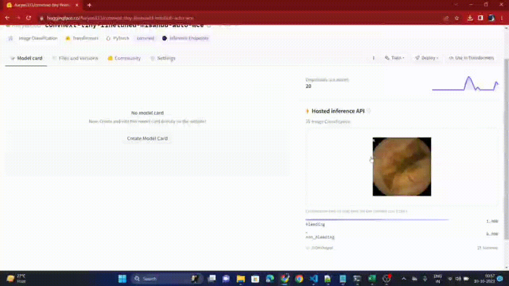

# Team-Data-Slayers-Auto-WCEBleedGen-Challenge
A robust implementation of Auto-WCEBleedGen Classification and Detection

## Achieved Metrics of Classification and Detection on the Validation Dataset

| Accuracy | Recall | F1-Score | Average Precision | Mean-Average Precision | Intersection over Union(IoU)) |
|:--------:|:------:|----------|-------------------|------------------------|-------------------------------|
|    1.0   |   1.0  | 1.0      | 0.814             | 0.814                  | 0.709                         |

## Screenshots of 10 images from the validation dataset showcasing classification and detection

## Screenshots of 5 images from the test dataset 1 and 2 respectively showcasing classification and detection

## Running inference on test data

- Firstly run <code>pip install -r requirements.txt</code> to install all dependencies.
- Then run:
  
  <code>python classification_inference_on_test_datasets.py --image_folders "<path_to_test_data_1>" "<path_to_test_data_2>"</code>

This will save the results of inference on the test data in an excel file with a default name of "test_data_predictions_combined.xlsx". You can also change the name of the excel file by giving <code>--output_file</code> as a command line argument.

## Demo

Following video shows a demo of our classification model:

You can try yourself at: [classification_demo](https://huggingface.co/Aaryan333/convnext-tiny-finetuned-misahub-auto-wce)
